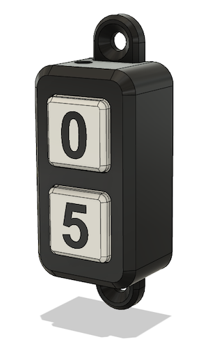
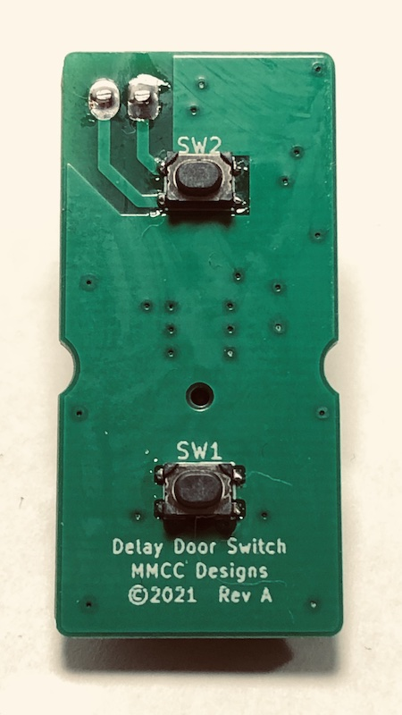
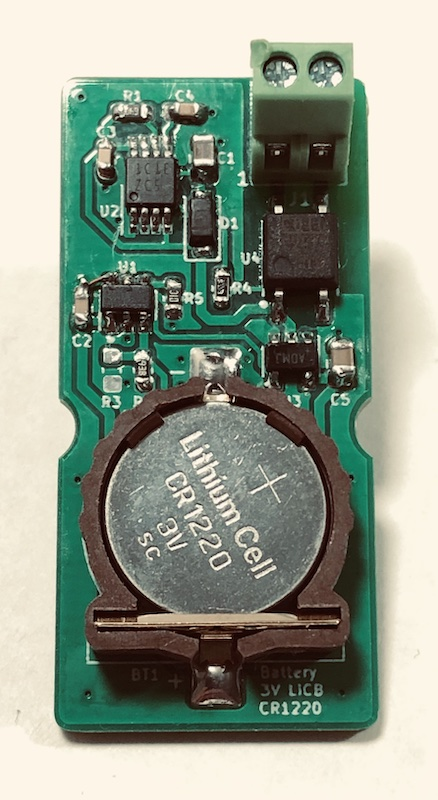
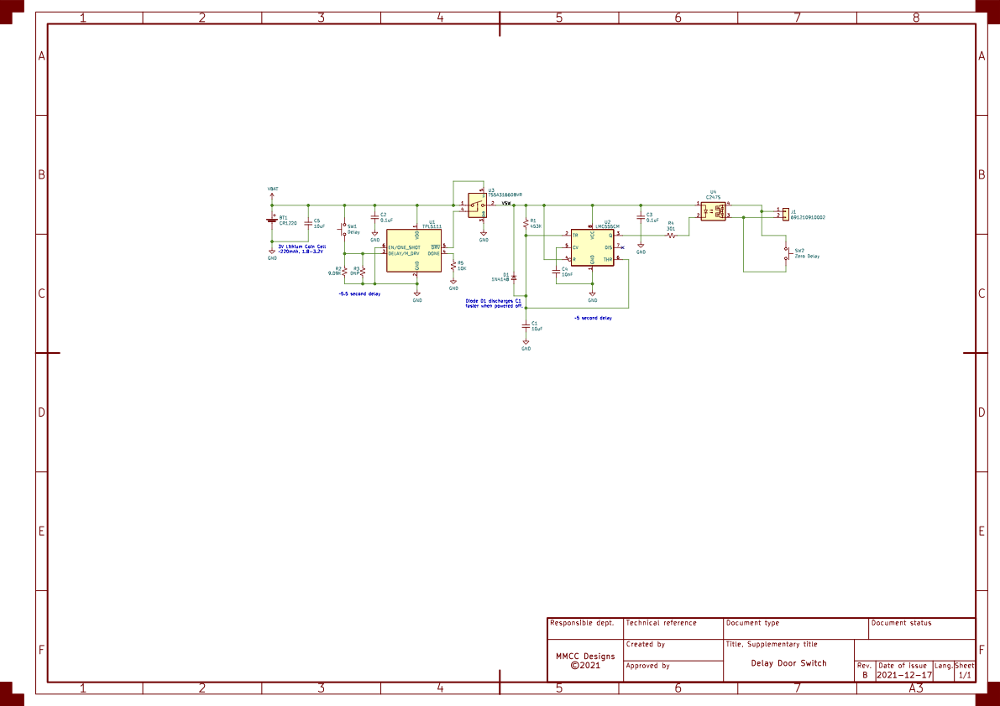
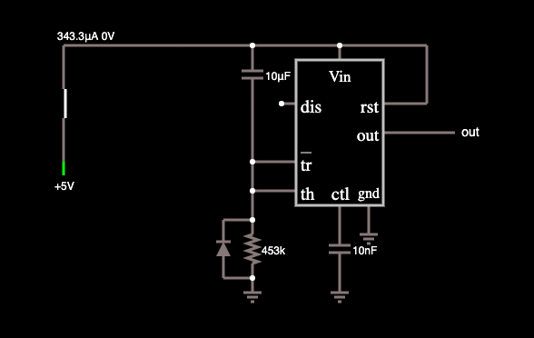
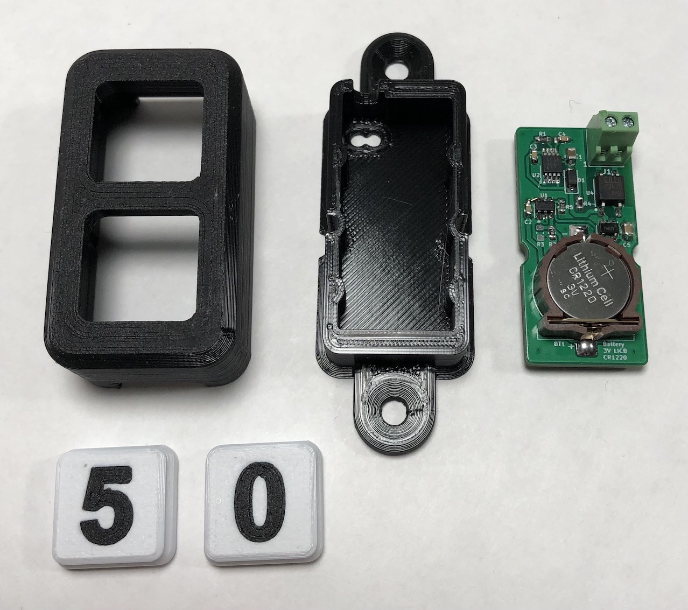

# Delay Door Switch

[![CC BY-NC-SA 4.0][cc-by-nc-sa-shield]][cc-by-nc-sa]

### Overview

The goal for this project was to make walking out of my garage, while the door closes, less of a race.  This is most likely an over-engineered solution to solve the problem but it does exactly what I wanted and is a fun use of a 555 timer.  The switch replaces the momentary switch used by my garage door opener but could be used anywhere a momentary switch is used to operate something.

The switch has two buttons: one closes the door immediately (zero delay) while the other delays 5 seconds before operating the door.  The delays are adjustable by selecting different component values, as detailed below.

The design includes both a printed circuit board and 3d printed enclosure.  No firmware is required.

## Delay Door Switch PCB

The PCB is available for order on [PCBWay Projects](https://www.pcbway.com/project/shareproject/Door_Delay_Switch_7a1f7a34.html).

| Front | Back |
|-------|------|
|  |  |

### Schematic

### Theory of Operation

For my garage door opener, pressing a normally-open momentary switch shorts two wires together causing the door to open or close.  The wires carry a 24VAC signal which was an important fact when selecting a solid state relay.  Other door openers or devices may differ in operation or signal levels so always check your own wiring.

To emulate a button press I selected a solid-state SPST-NO relay which was rated for AC signals (note that some solid-state relays only allow current in one direction so only work for DC signals).  When activated, the relay shorts the two wires just like the momentary button.  The zero delay button is wired in parallel with the relay so it operates independently from the delay circuit and does not require battery power.

Generating the delayed pulse to operate the relay was a little tricky.  One design requirement was an ultra-low standby power draw to maximize battery life.  Also keeping it simple and cheap meant anything with firmware was out.  I ended up using a two-timer architecture based around TI's [TPL5111 Nano-Power System Timer](https://www.ti.com/lit/ds/symlink/tpl5111.pdf) and a standard 555 timer.

The TPL5111 can run off a coin-cell battery, has an ultra-low (35nA typ) standby current and provides push-button operation so it fits the application perfectly.  A power switch controlled by the TPL5111 disconnects power from the remaining circuitry eliminating any quiescent current draw from those parts greatly reducing battery consumption.

The second timer is a standard 555 configured with a power-on delay.  After the delay time, the relay is activated by driving the SSR's LED.  The 555 remains in this state until it is powered off by the TPL5111.

The resulting interaction between the two timers generates a delayed pulse with the delay time set by the 555 power-on delay and the pulse length set by the TPL5111 activation period (TPL5111 active time - 555 power-on delay time = button press pulse length).  Luckily for the application we do not need either of these time periods to be very exact so standard resistor and capacitor tolerances are acceptable.  The component value calculations for these delay times are discussed in the next section.

The CR1220 battery choice was mostly arbitrary based on what I had on-hand.  There are other options that would work just as well or better.  Using rough calculations, one coin-cell should provide more than 1000+ button presses so works plenty fine for my application which may only close the door once per day.  The zero delay button uses no power and can operate even if the battery is drained.

### Delay Setting Calculations

Notes:

* The TPL5111 power-on time must be longer than the 555 delay time otherwise the relay pulse will not occur.
* The pulse time for the relay needs to be adjusted depending on the device being controlled.
* The longer the pulse is active the more power is used, reducing the clicks per battery life ratio.

#### To set the TPL5111 power-on time:

In one-shot mode, the TPL5111 will activate once per button click (built-in input debouncing is provided).

The delay time is set by adjusting the resistance value on pin 3 via the R2 and R3 resistors.  The two parallel resistors allow fine tuning of the resistance using standard E96 values but only one resistor is required if a standard value is close enough.

For my garage door, I selected a 9.09K resistor for R2 and left R3 unpopulated.  This sets the delay time slightly longer than 5.5 seconds based on using Equation 1 with coefficient Set 2 from [Page 12](https://www.ti.com/lit/ds/symlink/tpl5111.pdf#page=12) of the data sheet.

(-2651.8889-100*5.5)%7D%7D%7B2*-0.1284%7D%5Cbig)%20%3D%209055%20%20%5COmega%20)

For simplicity, [Page 13](https://www.ti.com/lit/ds/symlink/tpl5111.pdf#page=13) of the data sheet has a table of calculated resistor values.

#### To set the LM555 power-on delay time:

The 555 timer uses R1 and C1 to set the power-on delay time using the formula T = 1.1 * R1 * C1.  Selecting values of 453K and 10uF for R1 and C1 we get a delay slightly less than 5 seconds.

The relay pulse time is determined by how long the TPL5111 remains active after the 555 delay time.  For this example, the pulse time will be slightly longer than half a second (5.582s - 4.983s = 0.599s).

### 555 Power-On Delay Circuit

There are many configurations for the 555 timer.  The following circuit demonstrates a 555 timer that will set the output high after an initial power-on delay time.  The resistor and capacitor values are calculated using the formula T = 1.1 * R * C.

[Circuit Simulation](https://www.falstad.com/circuit/circuitjs.html?ctz=CQAgjCAMB0l3BWEBmAHAJmgdgGzoRmACzICcpkORICONNkNApgLRhgBQYOSyC64MAOQ5UggdUgcA8jSHhcNHIzCLGUgO4p0jVIyLcQeqBwDG23Y2Q7wRSVFjxI5F67fkoJgOYWUI33wC6hwATr7oWMI2yP76CMjwHFoGdMYI8sZSPnZiERJEuahiwVrWjDpiZSDoRCXVtUZWNplmICnVkW2GMXQqrMXeXXQ9Qyj8nprgyo31liZa7ALG3HPIHADO4jOL1ZADjABmAIYANutMHABKWxU3DeptjEgPMAhJbcuK6QKqve-ftmoBRUdnm4U6VRqdQBaXkxEk70Cu0qNlukyRUPC90RNnh4T2JgAJtUin46OhSXlquAAHIGArvCm5CGozqTJlkgKxDgAe3A2k8BkgAmejjgpFwtHwnl4nmQKF2nmiIB5AFcAC4ABw1HCAA)

### Bill of Materials

|   Ref   |   Value                    |   Digikey P/N   |  Alternate P/N |
|:-------:|:---------------------------|:---------------:|:---------------:|
| BT1     | CR1220 Battery Holder      | [2057-BH-44C-5-ND](https://www.digikey.com/en/products/detail/adam-tech/BH-44C-5/13537709) |
| C1,C5   | 10uF Capacitor 0805        | [1276-2935-1-ND](https://www.digikey.com/en/products/detail/samsung-electro-mechanics/CL21B106KQQNFNE/3888593) |
| C2,C3   | 0.1uF Capacitor 0603       | [1276-1935-1-ND](https://www.digikey.com/en/products/detail/samsung-electro-mechanics/CL10B104KB8NNWC/3887593) |
| C4      | 10nF Capacitor 0603        | [1276-1009-1-ND](https://www.digikey.com/en/products/detail/samsung-electro-mechanics/CL10B103KB8NNNC/3886667) |
| D1      | 1N4148 Diode SOD-123F      | [1N4148WRHGCT-ND](https://www.digikey.com/en/products/detail/taiwan-semiconductor-corporation/1N4148W-RHG/7357065) |
| J1      | 2.54mm Terminal Block      | [732-691210910002-ND](https://www.digikey.com/en/products/detail/würth-elektronik/691210910002/10668428) |
| R1      | 453K Resistor 0603         | [RMCF0603FT453KCT-ND](https://www.digikey.com/en/products/detail/stackpole-electronics-inc/RMCF0603FT453K/1761122) |
| R2      | 9.09K Resistor 0603        | [RMCF0603FT9K09CT-ND](https://www.digikey.com/en/products/detail/stackpole-electronics-inc/RMCF0603FT9K09/1760881) |
| R4      | 301 Resistor 0603          | [RMCF0603FT301RCT-ND](https://www.digikey.com/en/products/detail/stackpole-electronics-inc/RMCF0603FT301R/1760800) |
| R5      | 10K Resistor 0603          | [RMCF0603FT10K0CT-ND](https://www.digikey.com/en/products/detail/stackpole-electronics-inc/RMCF0603FT10K0/1761235) |
| SW1,SW2 | PTS810 Switch              | [CKN10878CT-ND](https://www.digikey.com/en/products/detail/c-k/PTS810-SJS-250-SMTR-LFS/4142163) |
| U1      | TPL5111 Nano-Power Timer   | [296-42621-1-ND](https://www.digikey.com/en/products/detail/texas-instruments/TPL5111DDCT/5358032) |
| U2      | LMC555CM Timer VSSOP-8     | [LMC555CMMX/NOPBCT-ND](https://www.digikey.com/en/products/detail/texas-instruments/LMC555CMMX-NOPB/367381) |
| U3      | TS5A3166DBVR Analog Switch | [296-17740-1-ND](https://www.digikey.com/en/products/detail/texas-instruments/TS5A3166DBVR/716904) | [MAX4626EUK+TCT-ND](https://www.digikey.com/en/products/detail/analog-devices-inc-maxim-integrated/MAX4626EUK-T/1016411) |
| U4      | C247S Solid-State Relay    | [306-1309-ND](https://www.digikey.com/en/products/detail/coto-technology/C247S/3961372) |
|  | 3D Printed Case | | |
| 2 | M2.5-0.45 x 16mm Screws | | [54FR55](https://www.grainger.com/product/GRAINGER-APPROVED-Machine-Screw-M2-5-0-45-Thread-54FR55) |

## Delay Door Switch Case

A 3d printed two-button case was designed in Fusion 360 to house the board.  The case's intended usage is indoors therefore not water tight and was printed in PLA on an FDM printer.

The case and buttons were printed on an Ender 3 Pro using a 0.2mm layer height.  No supports are required.  

A two-stage process was used for the integrated button numbers.  See this [video](https://youtu.be/0Sla-vIsvh4) for details on the process.  Basically, print the numbers first, change the filament color, print the rest of the button.  When slicing, the numbers and buttons have to be aligned exactly on the build plate and z-hop needs to be enabled to prevent the nozzle dragging through the numbers.

The case and buttons can be modified from the included STEP model if needed, or you can just print the other files if you like it as is.

#### Files:

| Description | File |
|:-----------|:-----:|
| Full Model (STEP Format)     | [`Delay_Door_Switch_Case.step`](case/Delay_Door_Switch_Case.step)
| Door Switch Front Case       | [`Door_Switch_Case.3mf`](case/Door_Switch_Case.3mf) |
| Door Switch Back Lid         | [`Door_Switch_Lid.3mf`](case/Door_Switch_Lid.3mf)  |
| Button Numbers (print first) | [`Button_Numbers.stl`](case/Button_Numbers.stl) |
| Buttons (print second)       | [`Buttons.stl`](case/Buttons.stl) |

## Assembly

The switch PCB is sandwiched between the front case and the back lid and held in place with two M2.5-0.45 x 16mm flat-head machine screws.

#### Assembly Steps

1. Drop the buttons into the front case (making sure the numbers are right-side up).
2. Feed the wire through the hole in the case.
3. Attach the wire to the PCB terminal block.
4. Place the PCB with the front-side facing the buttons.
5. Place the back lid on making sure to check that the PCB is aligned with the mounting holes.
6. Insert the two M2.5x16mm screws to hold the switch together.
7. Verify the buttons click properly.
8. Attach the switch to the wall with drywall (or similar) screws.

## License

[![CC BY-NC-SA 4.0][cc-by-nc-sa-image]][cc-by-nc-sa]

[cc-by-nc-sa]: http://creativecommons.org/licenses/by-nc-sa/4.0/
[cc-by-nc-sa-image]: https://licensebuttons.net/l/by-nc-sa/4.0/88x31.png
[cc-by-nc-sa-shield]: https://img.shields.io/badge/License-CC%20BY--NC--SA%204.0-lightgrey.svg

This work is licensed under the *non-commercial* [Creative Commons Attribution-NonCommercial-ShareAlike 4.0 International License][cc-by-nc-sa] due to the use a personal/hobbyist edition of [Autodesk Fusion 360](https://www.autodesk.com/products/fusion-360) for parts of the design.

No warranties or guarantees of any kind.

## References & Other Reading

* [Generating a delayed pulse with one 555 timer upon powering up the circuit](https://electronics.stackexchange.com/questions/245753/generating-a-delayed-pulse-with-one-555-timer-upon-powering-up-the-circuit)
    * [Follow up post with value calculations](https://electronics.stackexchange.com/questions/415378/generating-a-delayed-pulse-of-0-5sec-with-one-555-timer-upon-powering-up-the-cir)
* [Creating two delayed pulses from a 556](https://forum.allaboutcircuits.com/threads/creating-2-delayed-pulses-from-a-556.129043/)
* [Lots of 555 timer circuits](http://www.555-timer-circuits.com)
* [Pulse Delay Circuit Using 555 Timer](https://forum.allaboutcircuits.com/threads/pulse-delay-circuit-using-555-timer.149724/)
* Part Datasheets
	* [TPL5110 Nano-Power System Timer](https://www.ti.com/lit/ds/symlink/tpl5110.pdf)
	* [TPL5111 Nano-Power System Timer](https://www.ti.com/lit/ds/symlink/tpl5111.pdf)
	* [LMC555 CMOS Timer](https://www.ti.com/lit/ds/symlink/lmc555.pdf)
